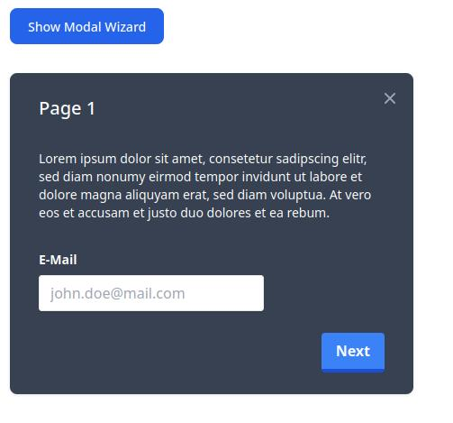
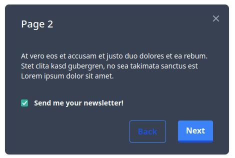
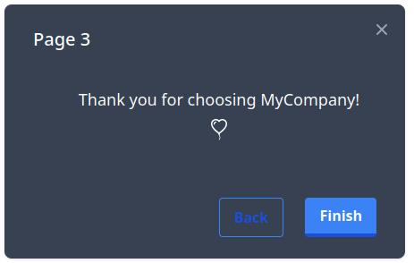

# Modal Wizard

Simple Modal Wizard for HTML/JS. Flexible and extensible with zero dependencies.

## Usage

Include `modalwizard.js` in your HTML:

```html
<script src="modalwizard.js"></script>
```

Define the modal wizards and their pages in HTML. Note that modalwizard.js expects certain keywords, otherwise it won't be able
to find buttons, inputs, etc.

```html
<div id="modal1">...</div>
```

The `id` of the modal window can be chosen arbitrary, but pages and buttons have to be prefixed by this id, e.g.:

```html
<!-- first page: -->
<div id="modal1_page1"></div>
```

Pages have to be enumerated from 1 to the number of pages and need to have the id `[modalname]_page[idx]`.

The following buttons are supported: Close, Next, Back, and Finish. Their respective names have to be:
`[modalname]_page[idx]_btn_[buttonname]` where `buttonnname = btn_close / btn_next / btn_back / btn_finish`

Note that it's totally valid to have only a subset of these buttons on a page.

Finally, call the `initModals` method on window load, for example:

```html
<script type="text/javascript">
    window.onload = function () {
        let modals = initModals(["modal1"]);
    ...
```

You can hook validation functions to pages:

```js
modals["modal1"].pages[0].validation_callback = function () {
    let email = document.getElementById("email");
    if (!email.value.includes("@")) {
        email.style.borderColor = "red";
        return false;
    }
    return true;
};
```

You can define a function which is called when the modal wizard is finished, and which gets all the data a user input
while clicking through the wizard:

```js
modals["modal1"].finish_callback = function (data) {
    console.log(data);
};
```

## Example

For a full example, open the `demo.html` file in your favorite browser. It was written with the help of [Tailwind CSS](https://tailwindcss.com/).




